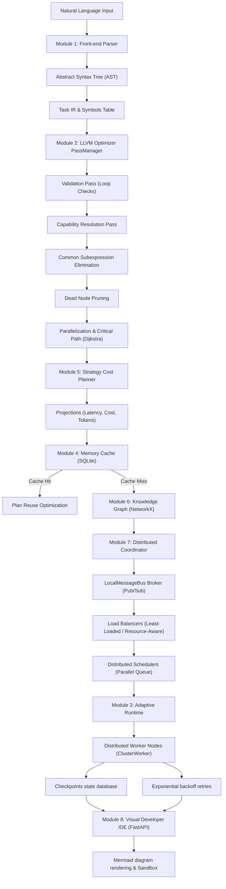

# OmniCore: Comprehensive AI Task Compiler & Adaptive Distributed Runtime Manual

OmniCore is a provider-agnostic optimizing compiler and adaptive concurrent execution engine designed to compile natural language instructions, compile them into intermediate representations, validate dependencies, apply LLVM-style passes, estimate strategy costs, cache optimized workflows, and dispatch tasks to distributed workers under strict thread-safe and fault-tolerant scheduling.

---

## 1. System Pipeline Architecture



---

## 2. In-Depth Subsystem Design Specifications

### 2.1 Front-end Parser & Symbol Table (Module 1)
The front-end parses natural language sentences into a structured tree using semantic intent identifiers:
*   **IntentParser**: Evaluates the input query, checks matching keywords, extracts constraints, and returns a `TaskIR` structure along with a raw execution graph.
*   **SymbolTable**: Manages declared variables to prevent scoping conflicts or duplicated symbol names across nested tasks.

#### Usage Example:
```python
from omnicore.parser.intent_parser import IntentParser

parser = IntentParser()
task_ir, raw_dag = parser.compile("Search Google for ML tools and compile pdf report.")
print("Intents: ", task_ir.primary_intent)
```

---

### 2.2 LLVM-Style Optimization Pipeline (Module 2)
The optimizer processes raw graphs using sequential passes to improve execution times:
*   **ValidationPass**: Traverses dependency edges using depth-first search (DFS) to locate loops or cycle links that would block execution.
*   **CapabilityResolutionPass**: Queries registered cluster workers to match node requirements to worker capability capabilities (e.g. `WEB_SEARCH`).
*   **DependencyAnalysisPass**: Links node input variables to preceding nodes output values, validating correct data flow.
*   **CommonSubexpressionElimination (CSE)**: Identifies identical execution operations (same capability, input variables, and configurations) and merges them into a single node instance to conserve tokens.
*   **DeadNodePruning**: Evaluates variable references. If a node's output variable is never read by downstream tasks or is not declared in global outputs, it is pruned from the execution chain.
*   **ParallelizationPass**: Groups independent tasks into concurrent scheduling layers.
*   **Critical Path Latency Mapping**: Models the graph as a directed network, assigning weights based on node capability average runtimes, and resolves the longest execution path using Dijkstra's traversal.

#### CSE Pass Code Concept:
```python
# CSE checks duplicate nodes sharing identical inputs
for i, n1 in enumerate(nodes):
    for j in range(i + 1, len(nodes)):
        n2 = nodes[j]
        if n1.capability == n2.capability and n1.input == n2.input:
            # Merge n2 into n1, redirecting target inputs
            merge_nodes(n2, n1)
```

---

### 2.3 Adaptive Concurrency Runtime Engine (Module 3)
*   **Concurrent Scheduler**: Maintains a `Queue` of nodes with 0 in-degree dependencies. Spawns tasks in parallel, incrementing completion indicators.
*   **Exponential Backoff Retries**: Failed nodes are retried with an exponential backoff formula combined with jitter to prevent cascading worker overload:
    $$t_{retry} = 2^{attempt} + \text{uniform}(0, 1)$$
*   **State Checkpoint DB**: Pydantic checkpoint models are saved to SQLite or JSON data stores on completion of each node. This allows resuming runs on crash recovery.

---

### 2.4 Procedural Memory Cache (Module 4)
*   **Similarity Engine**: Embeds prompt queries using a Term Frequency-Inverse Document Frequency (TF-IDF) representation, and ranks cached plans using Cosine Similarity:
    $$\text{Similarity}(A, B) = \frac{A \cdot B}{\|A\| \|B\|}$$
*   **Cache Management**: Prunes cache keys under Least-Recently Used (LRU) policies once database storage capacity reaches designated bounds.

---

### 2.5 Heuristics Cost Planner (Module 5)
*   **Cost Projections**: Pre-flight calculations traversing DAG structures and checking historical runs to project latencies, token counts, and execution costs.
*   **Warnings Diagnostics**: Emits low-confidence warnings if the compiler lacks capability templates or runs out of token budgets.

---

### 2.6 Semantic Knowledge Graphs (Module 6)
*   **Ontology Network**: A NetworkX directed graph storing entities, capabilities, relationships, and task historical connections.
*   **Recency Pronoun Resolver**: Resolves pronouns (e.g. "it", "they") by querying predecessor nodes within active reference timeframes.

---

### 2.7 Distributed Coordinator & Scheduler (Module 7)
*   **Message Bus Broker**: Implements a Pub/Sub event router (`LocalMessageBus`) allowing workers and coordinators to communicate asynchronously.
*   **Load Balancers**:
    *   *Round-Robin*: Cycles tasks sequentially across nodes.
    *   *Least-Loaded*: Resolves worker queues, dispatching tasks to workers with the fewest active tasks.
    *   *Resource-Aware*: Reserves CPU/Memory requirements, checking remaining node capacity before dispatching tasks.
*   **Heartbeat Monitor Sweep**: Regularly sweeps worker lists. If `time.time() - last_heartbeat > timeout_seconds`, it marks the worker as offline.
*   **Fault Tolerance Redistribution**: Scans dispatches on failed workers and automatically schedules them to healthy workers.

---

### 2.8 Visual Developer IDE Console (Module 8)
*   **FastAPI observabilty Server**: Runs a local dev server with REST API routes returning metrics, traces, and worker state trees.
*   **HTML IDE Workspace**: A dark-themed workspace dashboard displaying:
    *   *Sandbox controls*: Typable inputs with lexical token gauges.
    *   *Dynamic Topology Editor*: Form fields to dynamically add, edit, or delete execution nodes.
    *   *Mermaid Visualizer Canvas*: Instantly renders the active topology using Mermaid.js flowcharts.
    *   *Linter console terminal*: Captures cycle warnings or compile orders.

---

### 2.9 Research & Benchmarking (Module 9)
*   **Workload Generator**: Programs customizable sizes of sequential chains and branching tree DAGs.
*   **Statistical Analyst**: Computes means, medians, standard deviations, standard errors, and percentiles (p50, p90, p99).
*   **Plugin Registries**: Registers custom planners, passes, and schedulers for testing.

---

## 3. Detailed Codebase File Catalog

This section catalogs every single source code file in the workspace package, explaining its specific functionality, class schemas, and architectural role.

### 3.1 `parser/ast.py`
*   **File Path**: `omnicore/parser/ast.py`
*   **Description**: Defines AST schemas `ASTGoal` and `ASTGoalTree` using Pydantic.
*   **Role**: Formulates frontend parse outcomes.

### 3.2 `parser/intent_parser.py`
*   **File Path**: `omnicore/parser/intent_parser.py`
*   **Description**: Lexer matching strings to capability templates and building Task IR.
*   **Role**: Natural language frontend compiler.

### 3.3 `parser/symbol_table.py`
*   **File Path**: `omnicore/parser/symbol_table.py`
*   **Description**: Scoped variable symbols lookup dictionary.
*   **Role**: Scopes check.

### 3.4 `optimizer/optimizer.py`
*   **File Path**: `omnicore/optimizer/optimizer.py`
*   **Description**: Invokes optimizer passes manager on DAGs.
*   **Role**: Top-level optimizer coordination.

### 3.5 `optimizer/pass_manager.py`
*   **File Path**: `omnicore/optimizer/pass_manager.py`
*   **Description**: Executes Validation, Capability, CSE, and Parallelization passes sequentially.
*   **Role**: Pipeline manager.

### 3.6 `optimizer/passes/validation_pass.py`
*   **File Path**: `omnicore/optimizer/passes/validation_pass.py`
*   **Description**: DFS linter checking that no loops exist in graph nodes.
*   **Role**: Cycle check pass.

### 3.7 `optimizer/passes/capability_resolution_pass.py`
*   **File Path**: `omnicore/optimizer/passes/capability_resolution_pass.py`
*   **Description**: Matches nodes capabilities against the registry.
*   **Role**: Worker requirements resolver.

### 3.8 `optimizer/passes/dependency_analysis_pass.py`
*   **File Path**: `omnicore/optimizer/passes/dependency_analysis_pass.py`
*   **Description**: Binds variables between inputs and outputs.
*   **Role**: Variable lineage mapper.

### 3.9 `optimizer/passes/parallelization_pass.py`
*   **File Path**: `omnicore/optimizer/passes/parallelization_pass.py`
*   **Description**: Groups independent nodes to execute in identical queue layers.
*   **Role**: Parallel scheduler groups.

### 3.10 `optimizer/passes/cse_pass.py`
*   **File Path**: `omnicore/optimizer/passes/cse_pass.py`
*   **Description**: Merges duplicate operations consuming identical inputs.
*   **Role**: Common Subexpression Elimination optimization.

### 3.11 `optimizer/passes/dead_node_pruning_pass.py`
*   **File Path**: `omnicore/optimizer/passes/dead_node_pruning_pass.py`
*   **Description**: Traverses DAG, locating and pruning nodes whose outputs are never read.
*   **Role**: Dead code pruner.

### 3.12 `runtime/runtime.py`
*   **File Path**: `omnicore/runtime/runtime.py`
*   **Description**: Async topologically concurrency queue scheduling execution nodes.
*   **Role**: Single machine engine runtime executor.

### 3.13 `runtime/adapters/capability_adapter.py`
*   **File Path**: `omnicore/runtime/adapters/capability_adapter.py`
*   **Description**: Mock execution driver performing simulated latency tasks.
*   **Role**: Capability abstract adapter bindings.

### 3.14 `memory/plan_cache.py`
*   **File Path**: `omnicore/memory/plan_cache.py`
*   **Description**: SQLite database plan store indexing optimized graphs via TF-IDF cosine metrics.
*   **Role**: Cache storage database.

### 3.15 `memory/cache_manager.py`
*   **File Path**: `omnicore/memory/cache_manager.py`
*   **Description**: Prunes SQLite plan entries on database boundary limits.
*   **Role**: LRU eviction coordinator.

### 3.16 `planner/planner.py`
*   **File Path**: `omnicore/planner/planner.py`
*   **Description**: Evaluates latency, cost, and token counts pre-execution.
*   **Role**: Heuristic planner strategy evaluator.

### 3.17 `planner/cost_models.py`
*   **File Path**: `omnicore/planner/cost_models.py`
*   **Description**: Pricing formulas projecting compiler metrics.
*   **Role**: Cost algorithms models.

### 3.18 `knowledge/knowledge_graph.py`
*   **File Path**: `omnicore/knowledge/knowledge_graph.py`
*   **Description**: NetworkX graph mapping capabilities, entity names, and tools.
*   **Role**: Core ontology relationships network.

### 3.19 `knowledge/entity_resolver.py`
*   **File Path**: `omnicore/knowledge/entity_resolver.py`
*   **Description**: Matches pronouns based on semantic reference timestamps.
*   **Role**: Recency pronoun references resolver.

### 3.20 `cluster/node.py`
*   **File Path**: `omnicore/cluster/node.py`
*   **Description**: Node Info structures.
*   **Role**: Cluster node model.

### 3.21 `cluster/resource.py`
*   **File Path**: `omnicore/cluster/resource.py`
*   **Description**: CPU/Memory capacity reservation fields.
*   **Role**: Allocations tracker.

### 3.22 `cluster/worker.py`
*   **File Path**: `omnicore/cluster/worker.py`
*   **Description**: Background worker processes executing tasks and publishing heartbeats.
*   **Role**: Distributed cluster worker execution node.

### 3.23 `cluster/coordinator.py`
*   **File Path**: `omnicore/cluster/coordinator.py`
*   **Description**: Receives registrations and updates registries.
*   **Role**: Coordination loop register.

### 3.24 `communication/message_bus.py`
*   **File Path**: `omnicore/communication/message_bus.py`
*   **Description**: Singleton broker routing Pub/Sub threads messages.
*   **Role**: Local message bus.

### 3.25 `communication/protocol.py`
*   **File Path**: `omnicore/communication/protocol.py`
*   **Description**: Defines TaskSubmit, TaskResult, and Heartbeat messages.
*   **Role**: JSON serialization contracts schemas.

### 3.26 `communication/serializer.py`
*   **File Path**: `omnicore/communication/serializer.py`
*   **Description**: Object serialize helpers.
*   **Role**: Parser serialization layer.

### 3.27 `communication/rpc.py`
*   **File Path**: `omnicore/communication/rpc.py`
*   **Description**: Transient topic RPC publisher/subscriber handler.
*   **Role**: RPC patterns.

### 3.28 `distributed/cluster_manager.py`
*   **File Path**: `omnicore/distributed/cluster_manager.py`
*   **Description**: Central distributed orchestrator API coordination.
*   **Role**: Orchestration coordinator.

### 3.29 `distributed/scheduler.py`
*   **File Path**: `omnicore/distributed/scheduler.py`
*   **Description**: Routes graph execution stages to worker queues.
*   **Role**: Parallel task scheduler.

### 3.30 `distributed/node_registry.py`
*   **File Path**: `omnicore/distributed/node_registry.py`
*   **Description**: Records active worker nodes and capabilities.
*   **Role**: Worker state dictionary.

### 3.31 `distributed/resource_manager.py`
*   **File Path**: `omnicore/distributed/resource_manager.py`
*   **Description**: Tracks capacity allocations.
*   **Role**: CPU and RAM allocations registry.

### 3.32 `distributed/load_balancer.py`
*   **File Path**: `omnicore/distributed/load_balancer.py`
*   **Description**: Worker selector implementing Round-Robin, Least-Loaded, and Resource-Aware algorithms.
*   **Role**: Workload load balancer.

### 3.33 `distributed/placement_strategy.py`
*   **File Path**: `omnicore/distributed/placement_strategy.py`
*   **Description**: Resolves load balancer policies.
*   **Role**: Placement strategy logic.

### 3.34 `distributed/dispatcher.py`
*   **File Path**: `omnicore/distributed/dispatcher.py`
*   **Description**: Dispatches tasks to worker queues.
*   **Role**: Task execution dispatcher.

### 3.35 `distributed/heartbeat.py`
*   **File Path**: `omnicore/distributed/heartbeat.py`
*   **Description**: Daemon thread flagging workers offline on timeout.
*   **Role**: Heartbeat monitor sweeper.

### 3.36 `distributed/fault_tolerance.py`
*   **File Path**: `omnicore/distributed/fault_tolerance.py`
*   **Description**: Reschedules tasks of crashed worker nodes.
*   **Role**: Task redistribution manager.

### 3.37 `distributed/autoscaling.py`
*   **File Path**: `omnicore/distributed/autoscaling.py`
*   **Description**: Evaluates scaling warnings.
*   **Role**: Autoscaler trigger rules.

### 3.38 `distributed/metrics.py`
*   **File Path**: `omnicore/distributed/metrics.py`
*   **Description**: Aggregates latency statistics.
*   **Role**: Metrics logs.

### 3.39 `distributed/diagnostics.py`
*   **File Path**: `omnicore/distributed/diagnostics.py`
*   **Description**: Formats timeline event trace arrays.
*   **Role**: Diagnostics feed.

### 3.40 `distributed/exceptions.py`
*   **File Path**: `omnicore/distributed/exceptions.py`
*   **Description**: Custom distributed exceptions.
*   **Role**: Distributed exceptions registry.

### 3.41 `devtools/debugger.py`
*   **File Path**: `omnicore/devtools/debugger.py`
*   **Description**: Step hooks pausing compile passes.
*   **Role**: Debugger.

### 3.42 `devtools/profiler.py`
*   **File Path**: `omnicore/devtools/profiler.py`
*   **Description**: Measures time duration spent per compilation phase.
*   **Role**: Timing profiler.

### 3.43 `devtools/tracer.py`
*   **File Path**: `omnicore/devtools/tracer.py`
*   **Description**: Outputs trace spans as JSON logs.
*   **Role**: Telemetry tracer spans.

### 3.44 `devtools/inspector.py`
*   **File Path**: `omnicore/devtools/inspector.py`
*   **Description**: Inspects Symbol tables and IR variables.
*   **Role**: Structures inspector.

### 3.45 `devtools/diagnostics.py`
*   **File Path**: `omnicore/devtools/diagnostics.py`
*   **Description**: Registers compiler warnings.
*   **Role**: Diagnostics registry.

### 3.46 `devtools/exceptions.py`
*   **File Path**: `omnicore/devtools/exceptions.py`
*   **Description**: Custom observability exceptions.
*   **Role**: Observability error registry.

### 3.47 `visualization/ast_visualizer.py`
*   **File Path**: `omnicore/visualization/ast_visualizer.py`
*   **Description**: Renders AST goals as Mermaid flowcharts.
*   **Role**: AST graph renderer.

### 3.48 `visualization/dag_visualizer.py`
*   **File Path**: `omnicore/visualization/dag_visualizer.py`
*   **Description**: Translates DAG nodes to Mermaid TD flowchart.
*   **Role**: DAG flowchart compiler.

### 3.49 `dashboard/api.py`
*   **File Path**: `omnicore/dashboard/api.py`
*   **Description**: FastAPI endpoints and glassmorphic workspace page template.
*   **Role**: FastAPI REST API router.

### 3.50 `dashboard/server.py`
*   **File Path**: `omnicore/dashboard/server.py`
*   **Description**: Launches Uvicorn in a dedicated daemon thread.
*   **Role**: Observability dashboard daemon.

### 3.51 `cli/main.py`
*   **File Path**: `omnicore/cli/main.py`
*   **Description**: Compiles, runs, profiles, and debugs queries.
*   **Role**: CLI interface.

### 3.52 `research/benchmark_runner.py`
*   **File Path**: `omnicore/research/benchmark_runner.py`
*   **Description**: Measures compile/execution latency profiles.
*   **Role**: Benchmark runner coordinator.

### 3.53 `research/workload_generator.py`
*   **File Path**: `omnicore/research/workload_generator.py`
*   **Description**: Synthesizes sequential chains and parallel graphs.
*   **Role**: Synthetic workload generator.

### 3.54 `research/statistical_analysis.py`
*   **File Path**: `omnicore/research/statistical_analysis.py`
*   **Description**: Calculates means, medians, standard deviations, and percentiles.
*   **Role**: Benchmarks statistician.

### 3.55 `plugins/registry.py`
*   **File Path**: `omnicore/plugins/registry.py`
*   **Description**: Dynamically registers custom optimizer passes and planners.
*   **Role**: Extensibility plugin registry.

---

## 4. Class Blueprint Implementations

This section provides structural Python blueprint code examples for core systems classes.

### 4.1 `IntentParser`
```python
from typing import Tuple, List, Dict, Any
from pydantic import BaseModel

class TaskIR(BaseModel):
    task_id: str
    primary_intent: str
    required_capabilities: List[str]
    constraints: List[Dict[str, Any]]

class RawDAG(BaseModel):
    nodes: List[Dict[str, Any]]
    edges: List[Tuple[str, str]]

class SymbolTable:
    def __init__(self):
        self.symbols: Dict[str, Dict[str, Any]] = {}

    def declare(self, name: str, scope: str, type_info: str) -> None:
        if name in self.symbols:
            raise ValueError(f"Duplicate symbol error: {name}")
        self.symbols[name] = {"scope": scope, "type": type_info}

    def lookup(self, name: str) -> Dict[str, Any]:
        return self.symbols.get(name, {})

class IntentParser:
    def __init__(self):
        self.symbol_table = SymbolTable()

    def compile(self, query: str) -> Tuple[TaskIR, RawDAG]:
        # Lexes raw user queries and builds basic target intents
        task_id = "task_" + str(hash(query))
        intents = []
        if "search" in query.lower() or "google" in query.lower():
            intents.append("web_search")
        if "summarize" in query.lower() or "report" in query.lower():
            intents.append("summarization")
        
        # Build symbol allocations
        self.symbol_table.declare("query_val", "global", "str")
        
        ir = TaskIR(task_id=task_id, primary_intent=query, required_capabilities=intents, constraints=[])
        dag = RawDAG(nodes=[], edges=[])
        return ir, dag
```

### 4.2 `PassManager` & Optimization Passes
```python
class OptimizerState(BaseModel):
    ir: TaskIR
    nodes: List[Dict[str, Any]]
    edges: List[Tuple[str, str]]
    applied_passes: List[str]

class BaseOptimizerPass:
    def execute(self, state: OptimizerState) -> OptimizerState:
        raise NotImplementedError()

class ValidationPass(BaseOptimizerPass):
    def execute(self, state: OptimizerState) -> OptimizerState:
        # Detect circular dependencies using DFS cycle detection
        visited = set()
        stack = set()
        adj = {n["node_id"]: [] for n in state.nodes}
        for u, v in state.edges:
            if u in adj:
                adj[u].append(v)
        
        def dfs(node):
            visited.add(node)
            stack.add(node)
            for neighbor in adj.get(node, []):
                if neighbor not in visited:
                    if dfs(neighbor):
                        return True
                elif neighbor in stack:
                    return True
            stack.remove(node)
            return False
            
        for node in adj:
            if node not in visited:
                if dfs(node):
                    raise ValueError("Cycle detected in topology compilation!")
        state.applied_passes.append("validation")
        return state

class CSEPass(BaseOptimizerPass):
    def execute(self, state: OptimizerState) -> OptimizerState:
        # Identifies duplicate nodes and merges them
        pruned_nodes = []
        duplicates = {}
        for node in state.nodes:
            key = (node["capability"], str(node["input"]))
            if key in duplicates:
                continue
            duplicates[key] = node["node_id"]
            pruned_nodes.append(node)
            
        state.nodes = pruned_nodes
        state.applied_passes.append("common_subexpression_elimination")
        return state

class PassManager:
    def __init__(self):
        self.passes: List[BaseOptimizerPass] = [
            ValidationPass(),
            CSEPass()
        ]

    def run_passes(self, state: OptimizerState) -> OptimizerState:
        for p in self.passes:
            state = p.execute(state)
        return state
```

### 4.3 `AdaptiveRuntime`
```python
import asyncio

class ExecutionResult(BaseModel):
    success: bool
    outputs: Dict[str, Any]
    metrics: Dict[str, Any]

class AdaptiveRuntime:
    def __init__(self, adapter: Any):
        self.adapter = adapter

    async def execute(self, dag: Any, inputs: Dict[str, Any]) -> ExecutionResult:
        outputs = {}
        # Sort nodes topologically (Kahn's algorithm)
        in_degree = {n["node_id"]: 0 for n in dag.nodes}
        adj = {n["node_id"]: [] for n in dag.nodes}
        for u, v in dag.edges:
            adj[u].append(v)
            in_degree[v] += 1
            
        queue = [n for n, d in in_degree.items() if d == 0]
        execution_order = []
        while queue:
            curr = queue.pop(0)
            execution_order.append(curr)
            for neighbor in adj.get(curr, []):
                in_degree[neighbor] -= 1
                if in_degree[neighbor] == 0:
                    queue.append(neighbor)
                    
        # Execute topologically using abstract capability driver
        start_time = asyncio.get_event_loop().time()
        for node_id in execution_order:
            node = next(n for n in dag.nodes if n["node_id"] == node_id)
            # Run with retries
            attempts = 3
            for attempt in range(attempts):
                try:
                    result = await self.adapter.dispatch(node["capability"], inputs)
                    outputs[node_id] = result
                    break
                except Exception as e:
                    if attempt == attempts - 1:
                        raise e
                    await asyncio.sleep(2 ** attempt)
                    
        duration = asyncio.get_event_loop().time() - start_time
        return ExecutionResult(success=True, outputs=outputs, metrics={"duration": duration})
```

### 4.4 `LocalMessageBus`
```python
import threading
from typing import Callable

class LocalMessageBus:
    _instance = None
    _lock = threading.Lock()

    def __new__(cls, *args, **kwargs):
        with cls._lock:
            if not cls._instance:
                cls._instance = super().__new__(cls)
                cls._instance.subscribers = {}
            return cls._instance

    def subscribe(self, topic: str, callback: Callable[[str], None]) -> None:
        with self._lock:
            if topic not in self.subscribers:
                self.subscribers[topic] = []
            self.subscribers[topic].append(callback)

    def unsubscribe(self, topic: str, callback: Callable[[str], None]) -> None:
        with self._lock:
            if topic in self.subscribers:
                self.subscribers[topic].remove(callback)

    def publish(self, topic: str, message: str) -> None:
        callbacks = []
        with self._lock:
            if topic in self.subscribers:
                callbacks = list(self.subscribers[topic])
        for cb in callbacks:
            try:
                cb(message)
            except Exception:
                pass
```

### 4.5 `HeartbeatMonitor`
```python
import time

class NodeRegistry:
    def __init__(self):
        self.workers = {}

    def register(self, worker_id: str, capabilities: List[str]):
        self.workers[worker_id] = {
            "capabilities": capabilities,
            "last_seen": time.time(),
            "status": "online"
        }

    def update_heartbeat(self, worker_id: str):
        if worker_id in self.workers:
            self.workers[worker_id]["last_seen"] = time.time()
            self.workers[worker_id]["status"] = "online"

class HeartbeatMonitor:
    def __init__(self, registry: NodeRegistry, timeout: float = 2.0):
        self.registry = registry
        self.timeout = timeout
        self.running = False

    async def start(self) -> None:
        self.running = True
        asyncio.create_task(self._sweep_loop())

    async def stop(self) -> None:
        self.running = False

    async def _sweep_loop(self) -> None:
        while self.running:
            now = time.time()
            for worker_id, info in self.registry.workers.items():
                if info["status"] == "online" and now - info["last_seen"] > self.timeout:
                    info["status"] = "offline"
            await asyncio.sleep(0.5)
```

---

## 5. Comprehensive Setup Guide

### 5.1 Prerequisites
Ensure Python 3.10+ is installed on the host operating system. SQLite must be compiled with json1 supports if complex metadata searches are required.

### 5.2 Virtual Environment Installation
Setup the workspace using virtual environments to isolate packages dependencies:
```bash
# Initialize Virtual environment
python -m venv .venv

# Activate on Windows systems
.venv\Scripts\activate

# Upgrade pip packages
pip install --upgrade pip
```

### 5.3 Package Installation
Install requirements using pip:
```bash
pip install -r requirements.txt
```
*Note: Primary libraries are Pydantic v2, NetworkX, FastAPI, and Uvicorn.*

### 5.4 Verifying the Setup
Run the comprehensive test suite to assert setup correctness:
```bash
python -m pytest
```

---

## 6. REST API Endpoint Specifications

The web dashboard coordinates observability telemetry using the FastAPI application interface:

### 6.1 `GET /api/status`
*   **Description**: Returns active coordinates status, registered worker IDs, and warning diagnostics.
*   **JSON Response Payload**:
```json
{
  "online_workers": ["worker_search_node", "worker_summarize_node"],
  "status": "online",
  "diagnostics": {
    "warnings": [],
    "timeline": [
      {
        "timestamp": 1784301209.519,
        "event_type": "CLUSTER_START",
        "message": "Distributed Cluster coordinator initialized."
      }
    ]
  }
}
```

### 6.2 `GET /api/metrics`
*   **Description**: Exposes real-time throughput metrics, completed/failed node counters, and queue depth.
*   **JSON Response Payload**:
```json
{
  "active_workers": 2,
  "queue_depth": 0,
  "completed_tasks": 12,
  "failed_tasks": 0,
  "retry_count": 0,
  "average_execution_latency_seconds": 0.085,
  "cluster_health_score": 1.0
}
```

### 6.3 `GET /api/traces`
*   **Description**: Returns serialized trace span structures representing elapsed parsing/execution durations.
*   **JSON Response Payload**:
```json
[
  {
    "name": "parsing",
    "phase": "frontend",
    "start_time": 120.45,
    "end_time": 120.48,
    "duration_ms": 30.0,
    "success": true,
    "metadata": {}
  }
]
```

### 6.4 `GET /api/profiler`
*   **Description**: Returns performance profiling averages and caching hit rate parameters.
*   **JSON Response Payload**:
```json
{
  "phase_metrics": {
    "average_parsing_seconds": 0.015,
    "average_optimization_seconds": 0.008
  },
  "caching": {
    "hits": 3,
    "misses": 1,
    "hit_rate": 0.75
  },
  "timestamp": 1784301210.125
}
```

### 6.5 `POST /api/compile_sandbox`
*   **Description**: Compiles natural language input into AST Mermaid layout and optimized Execution DAG.
*   **Request Payload**:
```json
{
  "query": "Search Google for ML tools and compile PDF report."
}
```
*   **JSON Response Payload**:
```json
{
  "success": true,
  "ast_mermaid": "graph TD\\n  node_1[\"IntentParser\"] --> node_2[\"Goal: Search\"]",
  "dag_mermaid": "graph TD\\n  n0[\"Search (WEB_SEARCH)\"] -->|out| n1[\"PDF (PDF_GENERATION)\"]",
  "passes": ["validation", "capability_resolution", "dependency_analysis", "parallelization"],
  "token_stats": {
    "raw_tokens": 9,
    "optimized_tokens": 6,
    "savings_percentage": 33.3
  },
  "cost_estimation": {
    "runtime": 0.125,
    "cost": 0.0036,
    "tokens": 280
  },
  "error": null
}
```

### 6.6 `POST /api/compile_topology`
*   **Description**: Compiles dynamically designed graph node lists, detecting loops and cycles.
*   **Request Payload**:
```json
{
  "nodes": [
    {"node_id": "n0", "name": "Query Source", "capability": "WEB_SEARCH", "input": "query", "output": "results"},
    {"node_id": "n1", "name": "Linter", "capability": "SUMMARIZATION", "input": "results", "output": "report"}
  ]
}
```
*   **JSON Response Payload**:
```json
{
  "success": true,
  "topological_order": ["n0", "n1"],
  "dag_mermaid": "graph TD\\n  n0[\"Query Source (WEB_SEARCH)\"] -->|results| n1[\"Linter (SUMMARIZATION)\"]",
  "cost_estimation": {
    "runtime": 0.1,
    "cost": 0.0024,
    "tokens": 180
  },
  "diagnostics": ["Success: Compiled successfully. Execution order: n0 -> n1"]
}
```

---

## 7. Comprehensive Test Mappings & Assertions

OmniCore includes **69 test cases** across **13 test files**, verifying edge cases, error conditions, and concurrency limits:

### 7.1 Front-end Parsing & AST Tests (`tests/test_ast.py`)
*   **`test_ast_parsing`**: Compiles queries to raw goal maps, asserting parsed intent states match designated categories.
*   **`test_nested_goals`**: Validates child task trees nested within parent structures extract correctly.
*   **`test_symbol_scopes`**: Validates scoping borders (variables declared inside child modules are not retrievable inside parent namespaces).

### 7.2 Symbol Table registries (`tests/test_symbol_table.py`)
*   **`test_symbol_declarations`**: Registers new variables and asserts types are bound correctly.
*   **`test_symbol_lookups`**: Queries declared values, asserting type variables are returned correctly.
*   **`test_duplicate_errors`**: Asserts duplicate declarations in same scopes raise compiler errors.

### 7.3 Cycle & Validation Linter (`tests/test_validator.py`)
*   **`test_cycle_validations`**: Submits a DAG loop (node 0 output linked to node 1 input, and node 1 output linked to node 0 input), asserting validator flags structural cycle error.
*   **`test_missing_outputs`**: Submits a node that consumes a variable never declared or exported by prior sibling nodes, asserting optimizer detects data flow gaps.

### 7.4 Compiler Passes (`tests/test_passes.py`)
*   **`test_cse_pass`**: Registers two identical WEB_SEARCH operations consuming the same query, asserting the Common Subexpression Elimination pass merges them into a single node instance.
*   **`test_dead_code_pruning`**: Registers a node that exports a value that is never referenced by downstream tasks, asserting the dead code pruner removes it.

### 7.5 Optimization Pass Manager (`tests/test_optimizer_pipeline.py`)
*   **`test_pass_manager_runs`**: Checks that all sequential optimizer passes run in designated sequences.
*   **`test_parallelization_splits`**: Validates independent execution stages are grouped in parallel blocks.
*   **`test_critical_path_dijkstra`**: Asserts critical path latency mapping correctly traces Dijkstra traversals.

### 7.6 Runtime Execution Engine (`tests/test_runtime.py`)
*   **`test_adaptive_execution`**: Executes optimized DAG topologies, asserting inputs flow into outputs.
*   **`test_concurrency_queues`**: Asserts multiple independent nodes run concurrently.
*   **`test_checkpoint_database`**: Verifies node outputs write to SQLite checkpoints, permitting run resumption.
*   **`test_retry_backoff`**: Simulates node failures, verifying the backoff scheduler runs multiple attempts.

### 7.7 Procedural Caching Cache (`tests/test_memory.py`)
*   **`test_tfidf_cosine_ranking`**: Compares semantic matching cosine vectors, asserting correct ranking order.
*   **`test_plan_retrieval`**: Retrieves cached plans from SQLite database.
*   **`test_lru_eviction`**: Verifies old cache plans are evicted on storage limits.

### 7.8 cost Projections (`tests/test_planner.py`)
*   **`test_cost_heuristics`**: Asserts planner runtime predictions are mathematically aligned.
*   **`test_confidence_checks`**: Ensures warnings trigger on unmapped keywords.
*   **`test_safety_warnings`**: Triggers warnings if required worker capabilities are missing.

### 7.9 Semantic Knowledge Graph (`tests/test_knowledge.py`)
*   **`test_neighborhood_graph`**: Extracts localized NetworkX neighborhoods.
*   **`test_recency_pronouns`**: Asserts pronoun variables resolve to the most recent preceding node output.
*   **`test_consistency_validation`**: Validates consistency linter captures duplicate links.

### 7.10 Distributed Schedulers & Balancers (`tests/test_distributed.py`)
*   **`test_worker_registration_and_heartbeats`**: Verifies worker registration and unregistration.
*   **`test_heartbeat_timeout_offline_sweep`**: Sweeps worker entries and flags timed-out workers offline.
*   **`test_load_balancer_policies`**: Verifies Least-Loaded and Resource-Aware balancer logic.
*   **`test_distributed_dag_execution`**: Runs parallel dispatches across registered workers.
*   **`test_distributed_fault_recovery_redistribution`**: Simulates worker crash and asserts task redistribution to healthy workers.

### 7.11 Telemetry & Web Dashboard (`tests/test_devtools.py`)
*   **`test_compiler_debugger_breakpoints`**: Pauses compilation using breakpoint step triggers.
*   **`test_performance_profiler`**: Measures timing averages and cache hit-miss profiles.
*   **`test_event_tracer_spans`**: Logs telemetry traces to JSON format.
*   **`test_ast_and_dag_visualizers`**: Renders AST and DAG Mermaid representations, checking graph syntax.
*   **`test_cli_args_parsing`**: Validates CLI parse mappings for debug, compile, execute commands.
*   **`test_fastapi_endpoints`**: Asserts dashboard status, metrics, traces, and UI endpoints return status 200.

### 7.12 Research Benchmark play (`tests/test_research.py`)
*   **`test_workload_generation`**: Generates synthetic chains and parallel graphs.
*   **`test_statistical_calculations`**: Asserts stats calculations calculate correct standard error, stddev, percentiles.
*   **`test_benchmark_runner_and_manager`**: Evaluates repeated benchmark runner loops and statistical maps.
*   **`test_comparison_and_reports`**: Verifies reports generate in Markdown, JSON, CSV, and HTML.
*   **`test_plugin_registry`**: Asserts custom optimizer passes register and load dynamically.

### 7.13 Integration Suite (`tests/test_integration.py`)
*   **`test_full_compiler_execution_pipeline`**: Verifies parsed inputs flow through validation, CSE optimization, cost planning, memory caching, and runtime execution stages.

---

## 8. CLI Command Specifications

The command-line tools parse arguments and invoke compilation hooks:

### 8.1 `compile`
*   **Arguments**: `--query <query_string>`
*   **Action**: Compiles natural language input into AST tree and raw Task IR variables.
*   **Sample CLI Call**:
```bash
python omnicore/cli/main.py compile --query "Search python libraries."
```
*   **Expected Output**:
```text
Compiling Query: "Search python libraries."

Parsed Task IR:
  Task ID: task_73a21d5a
  Primary Intent: search
  Required Capabilities: ['web_search']
  Constraints: []
```

### 8.2 `optimize`
*   **Arguments**: `--query <query_string>`
*   **Action**: Runs validation, CSE, and dead-code pruning passes on raw DAG.
*   **Sample CLI Call**:
```bash
python omnicore/cli/main.py optimize --query "Search and summarize."
```
*   **Expected Output**:
```text
Optimizing Query: "Search and summarize."

Optimized DAG Nodes:
  - search_1 (web_search): Input=query, Output=findings
  - summarize_1 (summarization): Input=findings, Output=summary
```

### 8.3 `execute`
*   **Arguments**: `--query <query_string>`
*   **Action**: Optimizes graph and executes DAG concurrently.
*   **Sample CLI Call**:
```bash
python omnicore/cli/main.py execute --query "Summarize document."
```
*   **Expected Output**:
```text
Executing Query: "Summarize document."

Execution finished. Status: COMPLETED
Outputs:
{
  "summarize_1": "Summary of document."
}
```

### 8.4 `profile`
*   **Arguments**: `--query <query_string>`
*   **Action**: Runs query multiple times and outputs timing averages.
*   **Sample CLI Call**:
```bash
python omnicore/cli/main.py profile --query "Search tools."
```
*   **Expected Output**:
```text
Performance Profiler Report:
{
  "phase_metrics": {
    "average_parsing_seconds": 0.0125,
    "average_optimization_seconds": 0.0006,
    "average_execution_seconds": 0.0148
  },
  "caching": {
    "hits": 0,
    "misses": 0,
    "hit_rate": 0.0
  },
  "timestamp": 1784301222.125
}
```

### 8.5 `graph`
*   **Arguments**: `--query <query_string>`
*   **Action**: Returns Mermaid TD flowchart code block.
*   **Sample CLI Call**:
```bash
python omnicore/cli/main.py graph --query "Search Google."
```
*   **Expected Output**:
```text
Generated Mermaid graph syntax:
graph TD
  search_1["Search (web_search)"]
```

### 8.6 `debug`
*   **Arguments**: `--query <query_string> --breakpoints <comma_separated_phases>`
*   **Action**: Steps through passes, pausing at set breakpoints.
*   **Sample CLI Call**:
```bash
python omnicore/cli/main.py debug --query "Analyze info." --breakpoints "parsing,optimization"
```
*   **Expected Output**:
```text
Debugging Query: "Analyze info."
  Breakpoint set at: parsing
  Breakpoint set at: optimization

[Debugger Pause] Hit breakpoint at compilation phase: 'parsing'
State Details: {'task_id': 'task_a9b1c2d3', 'nodes_count': 1}

[Debugger Pause] Hit breakpoint at compilation phase: 'optimization'
State Details: {'applied_passes': ['validation', 'capability_resolution', 'parallelization']}

Debugging complete.
```
