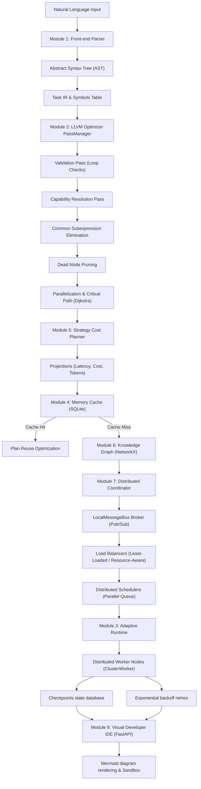

# OmniCore: AI Task Compiler & Adaptive Distributed Runtime

OmniCore is a provider-agnostic optimizing compiler and adaptive concurrent execution engine. It compiles natural language instructions into intermediate representations (Task IR / AST), validates dependency structures, applies LLVM-style optimization passes, projects execution costs, caches semantically similar plans, and dispatches tasks across distributed workers under thread-safe, fault-tolerant scheduling.

---

## System Architecture



---

## Core System Modules

OmniCore consists of 9 decoupled modules:

1. **Frontend Intent Parser & Symbol Table (`omnicore/parser`)**: Lexes natural language into structured AST (`ASTGoal`) and Task IR (`TaskIR`) while managing scoped symbol tables (`SymbolTable`).
2. **LLVM-Style Optimizer (`omnicore/optimizer`)**: Applies sequential optimization passes:
   - **Validation Pass**: DFS cycle detection for dependency graphs.
   - **Capability Resolution Pass**: Matches task capabilities to active cluster workers.
   - **Dependency Analysis Pass**: Binds input-output variable lineage.
   - **Common Subexpression Elimination (CSE)**: Merges duplicate nodes to minimize token usage.
   - **Dead Node Pruning**: Removes unused execution nodes.
   - **Parallelization & Critical Path**: Groups independent nodes and calculates critical path latency using Dijkstra's algorithm.
3. **Adaptive Concurrency Runtime (`omnicore/runtime`)**: Asynchronous topologically ordered queue executor with SQLite checkpointing and exponential backoff retries.
4. **Procedural Memory Cache (`omnicore/memory`)**: Stores and ranks compiled execution plans in SQLite using TF-IDF vector embeddings and Cosine Similarity, managed by LRU eviction.
5. **Strategy Cost Planner (`omnicore/planner`)**: Heuristically projects latencies, token counts, and execution costs before dispatching plans.
6. **Semantic Knowledge Graph (`omnicore/knowledge`)**: NetworkX directed ontology graph supporting entity-tool mapping and recency-based pronoun resolution.
7. **Distributed Cluster Orchestrator (`omnicore/distributed`, `omnicore/cluster`)**: Manages worker nodes, heartbeat sweep monitoring, task dispatches, and fault-tolerant redistribution over an async Pub/Sub event bus (`LocalMessageBus`).
8. **Observability IDE & Liquid Glass Web UI (`omnicore/dashboard`, `omnicore/devtools`, `omnicore/visualization`)**: React + TypeScript + Tailwind CSS dashboard with translucent frosted glass visuals, real-time Mermaid.js flowcharts, step debugging breakpoints, timing traces, and performance profiling.
9. **Research & Benchmarking Framework (`omnicore/research`, `omnicore/plugins`)**: Synthetic workload generation, statistical analysis (means, medians, standard errors, percentiles), and comparative optimization reporting.

---

## Codebase Directory Structure

```
omnicore/
├── cli/             # CLI application entry points
├── cluster/         # Worker node structure and capacity definitions
├── communication/   # Pub/Sub event bus broker and RPC protocol definitions
├── dashboard/       # FastAPI server & React + TS + Tailwind Liquid Glass UI (`frontend/`, `dist/`)
├── devtools/        # Compiler step debugger, profiler, tracer, inspector
├── distributed/     # Load balancers, node registry, heartbeat sweep, fault tolerance
├── IR/              # Enums and core IR models
├── knowledge/       # Semantic ontology graph and pronoun resolver
├── memory/          # Plan cache database & LRU manager
├── optimizer/       # Pass manager and LLVM-style optimization passes
├── parser/          # Frontend intent parser, AST generator, symbol table
├── planner/         # Cost models and heuristic strategy projection
├── plugins/         # Dynamic extension registry for custom passes/schedulers
├── research/        # Synthetic workload generator & statistical analyzer
├── runtime/         # Asynchronous execution engine & abstract capability adapters
└── visualization/   # AST and DAG Mermaid diagram generators
tests/               # Comprehensive pytest test suite (13 test modules)
examples/            # Integration and end-to-end usage examples
```

---

## Quickstart & Setup Guide

### 1. Prerequisites
- **Python 3.10+**
- **Node.js 18+** (for frontend development)

### 2. Environment Setup
```bash
# Create and activate virtual environment
python -m venv .venv
# On Windows PowerShell:
.venv\Scripts\activate
# On Linux/macOS:
source .venv/bin/activate

# Install dependencies
pip install -r requirements.txt
```

### 3. Run Verification Tests
```bash
python -m pytest
```

---

## CLI Usage

The command-line interface provides tools to parse, optimize, execute, profile, debug, and serve the dashboard:

```bash
# Start the Liquid Glass Dashboard server
python omnicore/cli/main.py dashboard --port 8001

# Parse natural language query into Task IR
python omnicore/cli/main.py compile --query "Search Google for ML tools and compile PDF report."

# Run LLVM optimization passes on a query
python omnicore/cli/main.py optimize --query "Search Python libraries and summarize findings."

# Execute a query end-to-end
python omnicore/cli/main.py execute --query "Summarize document."

# Profile compilation & runtime latency
python omnicore/cli/main.py profile --query "Search tools."

# Generate Mermaid TD graph flowchart
python omnicore/cli/main.py graph --query "Search Google."

# Debug compilation steps with breakpoints
python omnicore/cli/main.py debug --query "Analyze info." --breakpoints "parsing,optimization"
```

---

## Web IDE & Liquid Glass Dashboard

Launch the React + TypeScript + Tailwind CSS Liquid Glass dashboard server:

```bash
python -m omnicore.dashboard.server
```

Or run via CLI:
```bash
python omnicore/cli/main.py dashboard --port 8001
```

Access the UI at `http://127.0.0.1:8001` to experience:
- **Compiler Sandbox**: Interactive natural language query prompt with live lexical word & token count meters.
- **Visual Topology Canvas**: Interactive Mermaid.js diagram viewer displaying AST hierarchy trees, raw vs. optimized graph comparisons, and live colored node execution flowcharts.
- **Dynamic Topology Builder**: Interactive node builder to construct custom capability graphs and validate topological sorting & cycle detection in real-time.
- **Telemetry & Worker Pools**: Live cost projection cards, token reduction statistics, and active cluster worker monitor status cards.
- **Terminal Console**: macOS-style glowing execution log stream with status indicators and log controls.
- **Traces & Performance Profiler**: Performance report gauges detailing parsing and optimization phase durations alongside plan cache hit rates.

### REST API Summary
- `GET /`: Serves the React Liquid Glass Single Page Application.
- `POST /api/execute`: Compiles and executes a query asynchronously with live event bus progress.
- `GET /api/execution/{execution_id}`: Retrieves live execution status, node colors, and log streams.
- `GET /api/status`: Node worker statuses & cluster diagnostic events.
- `GET /api/metrics`: Queue depth, latency, task counters, and cluster health score.
- `GET /api/traces`: Compiler phase trace spans and duration breakdown.
- `GET /api/profiler`: Performance profiler metrics & plan cache hit rates.
- `GET /api/graphify_html`: Serves the interactive 3D Graphify Codebase Knowledge Graph (`graphify-out/graph.html`).
- `POST /api/compile_sandbox`: Compiles query to AST and optimized Mermaid DAG.
- `POST /api/compile_topology`: Validates and compiles custom node topologies.

---

## Cloud Deployment Guide

OmniCore supports 1-click cloud deployments on **Vercel**, **Render**, **Railway**, **Fly.io**, and **Docker**.

### 1. Vercel 1-Click Serverless Deployment
OmniCore includes pre-configured [`vercel.json`](file:///c:/Users/manis/OneDrive/Documents/python/AI_taskIR/vercel.json) and ASGI serverless handler [`api/index.py`](file:///c:/Users/manis/OneDrive/Documents/python/AI_taskIR/api/index.py):
1. Push repository to GitHub.
2. Import project into Vercel (**[vercel.com/new](https://vercel.com/new)**).
3. Vercel automatically detects `vercel.json`, builds the frontend React bundle (`dist`), and launches the Python FastAPI serverless backend!

### 2. Multi-Stage Docker Container Deployment
For container platforms (**Render**, **Railway**, **Google Cloud Run**, **AWS App Runner**):
```bash
# Build production Docker image
docker build -t omnicore-ai .

# Run container locally on port 8001
docker run -d -p 8001:8001 omnicore-ai
```

### 3. Render Blueprint Deployment
OmniCore includes [`render.yaml`](file:///c:/Users/manis/OneDrive/Documents/python/AI_taskIR/render.yaml) for 1-click Docker web service creation on Render:
1. Connect repository on **Render Dashboard**.
2. Render uses `render.yaml` (`runtime: docker`) to launch the service automatically on port `8001`.

---

## License

MIT License. See [LICENSE](LICENSE) for details.

